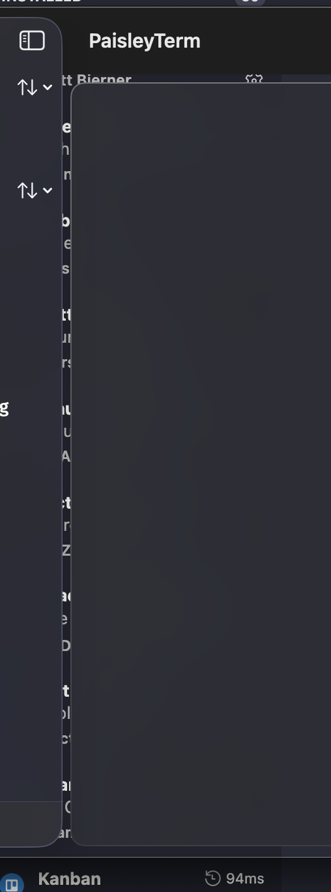

# PaisleyTerm

A macOS SSH session manager with a live AI-agent status dashboard. Run Claude Code or OpenCode on your remote machines and see what every agent is doing — thinking, running tools, waiting for your input — at a glance, from one native window.



## Why

If you run coding agents on several servers at once, you end up cycling through terminal tabs to check whether each agent is still working, stuck on a permission prompt, or done. PaisleyTerm puts every SSH session in a sidebar with a color-coded status dot driven by live parsing of the agent's terminal output — no server-side setup, no plugins, nothing to install on the remote host.

## Features

- **Session sidebar** — every connection in one list; click to bring its terminal forward
- **Live agent status** — a pulsing status dot per session: yellow (thinking), orange (running tools), blue (waiting for input), red (error), teal (done)
- **Agent detection for Claude Code and OpenCode** — status is inferred from terminal output; works over plain SSH with zero remote configuration
- **One-click agent control** — right-click a session to install, launch, or stop an agent
- **Native SwiftUI terminal** — real terminal emulation via [SwiftTerm](https://github.com/migueldeicaza/SwiftTerm), SSH via [Citadel](https://github.com/orlandos-nl/Citadel) (pure Swift, SwiftNIO)
- **Keychain-only credentials** — passwords never touch disk; profiles store no secrets
- **Trust-on-first-use host keys** — server keys are pinned on first connect and verified on every reconnect

## Status dot legend

| Color | Meaning |
|---|---|
| gray | disconnected / no agent |
| yellow | connecting, or agent thinking |
| green | connected, agent idle |
| orange | agent executing a tool |
| blue | agent waiting for your input |
| teal | agent finished |
| red | error |

## Requirements

- **macOS 15+** for SSH sessions (Citadel's PTY API requires it)
- macOS 14+ for local terminal sessions only
- Swift 5.9+ toolchain — **Xcode Command Line Tools are sufficient**, full Xcode not required

## Build and run

```bash
git clone https://github.com/rystedtcreative/PaisleyTerm.git
cd PaisleyTerm
swift build
```

The repo includes a `PaisleyTerm.app` bundle shell (Info.plist + icon) so the app runs with proper window focus and a dock icon. Copy the built binary into it:

```bash
swift build && cp .build/debug/PaisleyTerm PaisleyTerm.app/Contents/MacOS/PaisleyTerm
open PaisleyTerm.app
```

## Usage

1. Click **+** in the sidebar (or ⌘N) to add a connection — host, port, username, password (stored in your Keychain).
2. Click the session to connect; a full terminal opens.
3. Right-click the session row → **Claude Code** or **OpenCode** → **Launch** (with Install / Add to PATH helpers if the CLI isn't set up on the remote yet).
4. Watch the status dot. Blue means the agent is waiting on you.

## Current limitations

Honest list — contributions welcome (see [CONTRIBUTING.md](CONTRIBUTING.md)):

- **No SSH key authentication yet** — password auth only (key support needs NIOSSH private-key parsing; see issues)
- **No automatic reconnect** — a dropped session must be reconnected manually
- **PTY opens at a fixed 220×50** — resizes after connect work, but the initial size isn't taken from the window
- **OpenCode status patterns need calibration** against more real-world output
- Host key trust is silent TOFU — a first-connect fingerprint confirmation UI is planned

## Security

See [SECURITY.md](SECURITY.md) for the security model and how to report vulnerabilities. Highlights: passwords live only in the macOS Keychain, profiles are secret-free JSON, host keys are pinned trust-on-first-use in `~/Library/Application Support/PaisleyTerm/known_hosts.json`.

## Architecture

See [ARCHITECTURE.md](ARCHITECTURE.md) for the data-flow design, the Citadel PTY bridging trick, and how agent status parsing works.

## License

[MIT](LICENSE) © 2026 Joshua Rystedt
